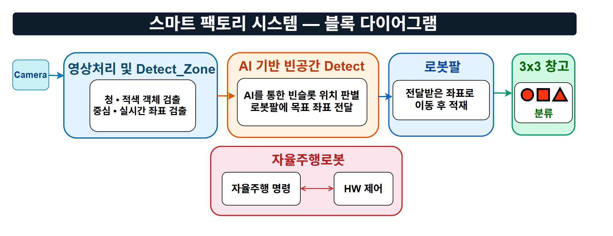
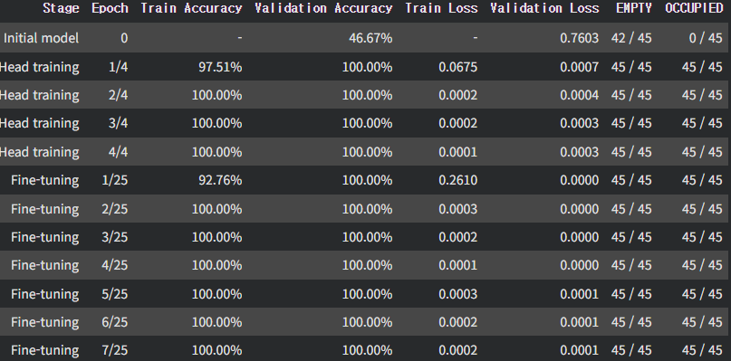
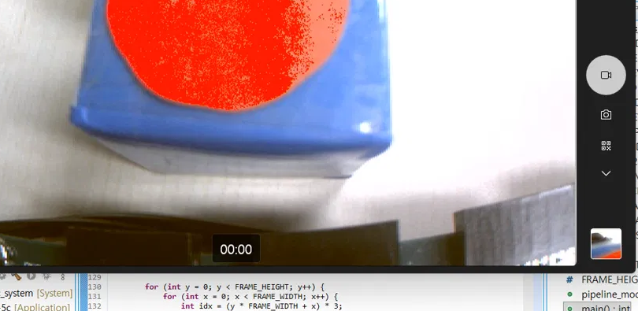

<div align="center">

# 🤖 스마트 물류 자율주행 로봇 시스템
### Smart Factory Logistics with Autonomous AMR & Vision AI

**RC Shuttle × FPGA Vision × Jetson AI × Robot Arm**

자율주행 셔틀이 물류 구역을 왕복하고, FPGA 영상처리로 물체를 인식하며,  
AI 비전이 적재함 상태를 모니터링하고, 로봇팔이 물체를 집어 빈 슬롯에 적재하는  
**End-to-End 스마트 팩토리 물류 자동화 시스템**

<br>

<p align="center">
  <b>팀명: 들었다 놓조</b>
</p>

<br>


</div>

---

<a id="demo"></a>
## 🎬 시스템 시연 (Demonstration)

| 🚗 자율주행 셔틀 (AMR) | 📷 FPGA 영상처리 & 도형 인식 |
|:---:|:---:|
|  |  |
| **LiDAR SLAM 기반 주행 및 슬롯 도킹** | **Pcam 5C 기반 실시간 HSV 추적 & 도형 판별** |

| 🧠 Jetson AI 적재함 모니터링 | 🦾 로봇팔 물류 파지 및 슬롯 적재 (통합 시연) |
|:---:|:---:|
|  |  |
| **MobileNetV3 (TensorRT FP16) 9슬롯 모니터링** | **OpenRB-150 기반 IK 역기구학 픽앤플레이스** |

---

<a id="index"></a>
## 📋 목차

- [🎬 시스템 시연](#demo)
- [🏗 시스템 아키텍처](#architecture)
- [📦 서브시스템 개요](#subsystems)
- [📂 디렉토리 구조](#structure)
- [🔧 하드웨어 구성](#hardware)
- [📡 통신 프로토콜](#protocol)
- [🛠 트러블슈팅 및 개선](#troubleshooting)
- [🚀 실행 방법](#getting-started)
- [⚙️ 기술 스택](#tech-stack)

---

<a id="architecture"></a>
## 🏗 시스템 아키텍처

<p align="center">
  
</p>

---

<a id="subsystems"></a>
## 📦 서브시스템 개요

### 1. 자율주행 셔틀 (`rc_shuttle/`)

| 항목 | 내용 |
|---|---|
| **플랫폼** | Raspberry Pi + RPLidar C1 |
| **언어** | C11 (43개 소스 모듈, 47개 헤더) |
| **기능** | 고정맵 LiDAR SLAM → A* 경로계획 → PID 추종 → 슬롯 주차 |
| **통신** | FPGA 모터보드 ↔ UART (속도·방향 명령 / 엔코더 피드백) |
| **빌드** | `make` (GCC, `-flto` LTO 최적화) |
| **뷰어** | `live_view.py` — matplotlib 실시간 시각화 |

👉 자세한 내용: [`rc_shuttle/README.md`](rc_shuttle/README.md)

---

### 2. Jetson AI 비전 & 통합 제어 (`jetson/`)

<p align="center">
  
</p>

| 항목 | 내용 |
|---|---|
| **플랫폼** | Jetson Orin Nano |
| **언어** | Python |
| **AI** | MobileNetV3-Small (TensorRT FP16), 9슬롯 EMPTY/OCCUPIED 이진분류 |
| **기능** | 적재함 실시간 모니터링 (웹 UI :8080) + FPGA·OpenRB 간 통합 디스패치 |
| **안전** | 5프레임 다수결 STABLE 판정, fail-closed 방식 |
| **통신** | FPGA → 8B UART (도형+좌표), Jetson → OpenRB 9B UART (좌표+슬롯) |

👉 자세한 내용: [`jetson/README.md`](jetson/README.md)

---

### 3. FPGA 영상처리 & 모터 제어 (`fpga/`)

| 서브모듈 | 내용 |
|---|---|
| **vision-pipeline** | Pcam 5C → MIPI → HSV 물체 추적 → HDMI 출력 + UART 좌표 전송 (Zybo Z7-20, Verilog/SV + Vitis C++) |
| **motor-control** | RC Car 모터 PWM 제어 + 엔코더 오도메트리 (Zybo Z7-20, SystemVerilog) |

👉 자세한 내용: [`fpga/README.md`](fpga/README.md)

---

### 4. 로봇팔 제어 (`arduino/`)

| 항목 | 내용 |
|---|---|
| **플랫폼** | OpenRB-150 + Dynamixel 서보 모터 |
| **언어** | Arduino C++ |
| **기능** | Jetson 좌표 수신 → 역기구학 보간 → 물체 집기 → 빈 슬롯 적재 |
| **특징** | 삼각형 보간 좌표 보정, 관절공간 선형보간, settle 안정 판정, RETRY 복구 |

👉 자세한 내용: [`arduino/README.md`](arduino/README.md)

---

<a id="structure"></a>
## 📂 디렉토리 구조

```
.
├── rc_shuttle/                  # 자율주행 셔틀 (C / Raspberry Pi)
│   ├── app/                     #   CLI 메인 엔트리 (main_shuttle.c)
│   ├── include/                 #   헤더 47개 (선언)
│   ├── src/                     #   실행 구현 모듈 43개
│   ├── viewer/                  #   live_view.py (실시간 시각화)
│   ├── maps/                    #   고정맵 (150×90, 10mm 격자)
│   ├── sim/                     #   오프라인 시뮬레이터 (Python ctypes)
│   ├── tests/                   #   단위 테스트
│   └── tools/                   #   하드웨어 브링업 도구
│
├── jetson/                      # Jetson AI 비전 & 통합 제어 (Python)
│   ├── runtime/                 #   시연 런타임 (TensorRT, V4L2, 통신)
│   ├── ai/                      #   학습 Colab 노트북, ONNX 모델
│   ├── tests/                   #   단위 테스트
│   ├── evidence/                #   검증 보고서 및 로그
│   └── docs/                    #   런타임 가이드 PDF
│
├── fpga/                        # FPGA 설계 (Verilog / SystemVerilog)
│   ├── vision-pipeline/         #   Pcam 영상처리 + Vitis PS
│   │   ├── vivado/              #     Block Design, RTL, 제약, Tcl
│   │   ├── vitis/               #     ARM PS 코드 (main.cc)
│   │   ├── artifacts/           #     BIT, XSA, ELF 산출물
│   │   └── docs/                #     블록 다이어그램
│   └── motor-control/           #   RC Car 모터 제어
│       ├── rtl/                 #     SystemVerilog 모듈 7개
│       ├── constraints/         #     FPGA 핀 매핑 (.xdc)
│       └── sim/                 #     테스트벤치 5개
│
├── arduino/                     # 로봇팔 제어 (OpenRB-150)
│   ├── openrb_robot_arm/        #   스케치 소스 (.ino)
│   └── README.md                #   제어 알고리즘 & 통신 프로토콜 설명
│
└── docs/                        # 프로젝트 문서 & 시연 자료
    ├── Smart_Factory_with_AMR.pptx  # 팀 프로젝트 발표 PPT
    └── images/                  # 시연 GIF 및 다이어그램
```

---

<a id="hardware"></a>
## 🔧 하드웨어 구성

| 장치 | 역할 | 인터페이스 |
|---|---|---|
| **Zybo Z7-20** (×2) | FPGA 영상처리 / 모터 제어 | HDMI, Pcam MIPI, UART, GPIO |
| **Jetson Orin Nano** | AI 추론, 통합 디스패치 | USB (카메라, UART×2) |
| **Raspberry Pi** | 자율주행 셔틀 제어 | USB (LiDAR, UART) |
| **RPLidar C1** | 360° LiDAR 스캐너 | USB-Serial |
| **Pcam 5C** | OV5640 MIPI 카메라 | MIPI CSI-2 |
| **Logitech C270** | 적재함 모니터링 카메라 | USB |
| **OpenRB-150** | 로봇팔 서보 컨트롤러 | TTL (Dynamixel), UART |
| **Dynamixel 서보** | 로봇팔 관절 구동 | TTL bus |
| **HC-SR04** | 초음파 안전 가드 | GPIO (Trig/Echo) |

---

<a id="protocol"></a>
## 📡 통신 프로토콜

### FPGA → Jetson (8바이트, 115200 8-N-1)
```
[AA] [SHAPE] [X_H] [X_L] [Y_H] [Y_L] [RESERVED] [XOR]
```
- `SHAPE`: `01`=원, `02`=사각, `03`=삼각
- `X/Y`: Big-endian 픽셀 좌표 (중심점)
- `XOR`: `SHAPE`~`RESERVED` XOR 체크섬

### Jetson → OpenRB (9바이트)
```
[AA] [55] [CMD_ID] [SLOT] [X_H] [X_L] [Y_H] [Y_L] [CRC8]
```
- `SLOT`: 빈 슬롯 번호 (1~9)
- `CRC8`: poly=0x07, init=0x00, 범위=`CMD_ID`~`Y_L` 6바이트

### OpenRB → Jetson (5바이트)
```
[AA] [55] [CMD_ID] [STATUS] [CRC8]
```
- `STATUS`: `06`=ACK, `07`=DONE, `15`=NAK, `E0`=BUSY, `E1`=FAULT

---

<a id="troubleshooting"></a>
## 🛠 트러블슈팅 및 개선 (Troubleshooting)

### 1. 조명 민감도 및 도형 인식 오류 개선
<p align="center">
  
</p>

- **문제점**: 주변 조명 변화에 따라 단순 RGB 임계값 방식에서 도형 오인식 및 경계 검출 실패 발생.
- **해결책**:
  - RGB ➔ **HSV 색공간 변환 및 색상 분류기** 하드웨어 RTL 구현.
  - Fourier Harmonic Noise Filter 및 모폴로지 기법을 적용하여 조명 노이즈에 강건한 윤곽선 검출 달성.

---

### 2. 엔코더 채터링 및 신호 동기화 (Debounce Filter)
<p align="center">
  
</p>

- **문제점**: 휠 엔코더 A/B 위상 신호의 바운싱 및 채터링으로 인해 위치 오차가 누적되는 현상 발생.
- **해결책**:
  - FPGA 내 신호 동기화 **디바운스 필터(Debounce Filter)** 설계 및 적용.
  - 휠 슬립과 펄스 튐 현상을 방지하여 안정적인 직진/회전 오도메트리 확보.

---

### 3. 로봇팔 파지 도달 안정성 (Settle Time) 확보
- **문제점**: 관절 이동 후 목표 지점 도달 판정이 너무 빨라 잔여 진동으로 인한 파지 실패 발생.
- **해결책**:
  - 단일 도달 판정에서 `SETTLE_STABLE_COUNT` 연속 만족 시 통과하는 안정화 딜레이 로직 도입.
  - 적재 진입 시 관절공간 선형보간 및 저속 가속도 프로파일(`PLACE_SPEED / PLACE_ACCEL`) 적용.

---

<a id="getting-started"></a>
## 🚀 실행 방법

### 1. 자율주행 셔틀 (Raspberry Pi)
```bash
cd rc_shuttle/
make          # main_shuttle 빌드
make run      # 실시간 live_view.py UI와 함께 실행
```

### 2. Jetson AI 비전 & 통합 제어 (Orin Nano)
```bash
# [Terminal 1] 실시간 적재함 비전 모니터링 & 웹 UI (:8080)
cd /home/aidl/work/robot_rack_project_20260811
./start_vision.sh \
  --max-allowed-shift 24 \
  --minimum-alignment-score 0.25 \
  --alignment-interval 0.5 \
  --occupied-threshold 0.98

# [Terminal 2] FPGA - OpenRB 통합 디스패처
cd /home/aidl/work/robot_rack_project_20260811
./start_controller.sh \
  --fpga-port /dev/ttyUSB1 \
  --openrb-port /dev/ttyUSB0 \
  --openrb-done-timeout 60
```

### 3. 로봇팔 제어 (OpenRB-150)
- Arduino IDE에서 `arduino/openrb_robot_arm/openrb_robot_arm.ino` 열기 ➔ 보드 `OpenRB-150` 선택 후 업로드. (상세 안내: [`arduino/README.md`](arduino/README.md))

---

<a id="tech-stack"></a>
## ⚙️ 기술 스택 (Tech Stack)

| 영역 | 기술 스택 | 설명 |
|---|---|---|
| **자율주행 (AMR)** | `C11`, `LiDAR SLAM`, `A* Path Planning`, `PID Control` | 2D 점유 격자 지도, 스캔매칭 위치추정, 동적 장애물 회피 |
| **AI 비전 (Edge AI)** | `Python`, `PyTorch`, `ONNX`, `TensorRT 10.3`, `MobileNetV3` | 9개 슬롯 점유 이진분류, FP16 가속, 5프레임 다수결 안정성 게이트 |
| **FPGA & 영상처리** | `Vivado 2024.1`, `Vitis`, `SystemVerilog`, `Verilog`, `AXI4-Stream` | MIPI CSI-2 수신, Bayer-to-RGB, 실시간 HSV 색상/도형 Bounding Box 추적 |
| **로봇팔 제어** | `Arduino C++`, `OpenRB-150`, `Dynamixel SDK`, `Inverse Kinematics` | 3차원 좌표 역기구학 연산, 삼각 보간 보정, 부드러운 관절 보간 |
| **시스템 통신** | `UART 115200 8-N-1`, `CRC8 (Poly 0x07)`, `XOR Checksum` | 장치 간 고신뢰성 패킷 규격, ACK/DONE/FAULT 상태 머신 |
| **UI & 시각화** | `Matplotlib (live_view)`, `Flask HTTP (:8080 웹 모니터)` | 셔틀 실시간 궤적 렌더링, 적재함 점유 상태 웹 대시보드 |

---

## 📄 License & Presentation

- **발표 자료**: [`docs/Smart_Factory_with_AMR.pptx`](docs/Smart_Factory_with_AMR.pptx)
- 본 프로젝트는 교육 및 스마트 팩토리 연구 목적으로 제작되었습니다.
